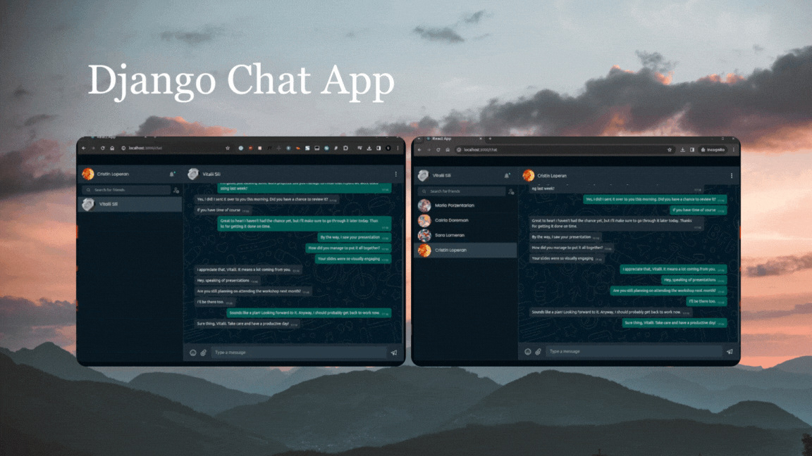
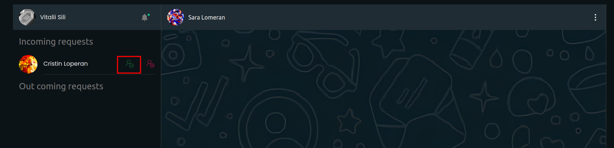

# Chat App


This project is a simple chat application built using React for the 
frontend and Django with WebSocket for the backend, allowing users 
to communicate with each other in real-time. It utilizes React components, 
React Hooks, Django Rest Framework, and Django Channels for managing chat 
functionality.

#### For demo [click here](https://chat.vitaliisili.com)

## Getting Started
To get started with this project, follow these steps:

- Navigate to frontend folder
```bash
 cd chat_app_frontend
```

- Install dependencies
```bash
npm install
```

- Create `.env` file look at `.env-example`
> REACT_APP_API_BASE_URL => backend url </br>
> REACT_APP_CLIENT_ID => oauth2 application id that was created with django in admin dashboard </br>
> REACT_APP_CLIENT_SECRET => oauth2 application secret (not hashed) that was created with django in admin dashboard </br>

- Run the application
```bash
npm start 
```

- Access the Application: </br>
Once the application is running, open your web browser and navigate to [http://localhost:3000/](http://localhost:3000/).


- Register new account then login

> To add user for chat search by email


> User that was invited will see invitation in notification



## Features
- Real-time Chat: Users can send and receive messages in real-time using WebSockets.
- User Authentication: Implement user authentication and authorization on the Django backend.
- Customizable UI: The UI components are built using React, making them easy to customize and extend.

## Contributing
Contributions are welcome! If you find any issues or have suggestions for improvement, please open an issue or 
submit a pull request on the GitHub repository.

## Contact
For any questions or inquiries about this project, feel free to contact [vitaliisili@yahoo.com](vitaliisili@yahoo.com)